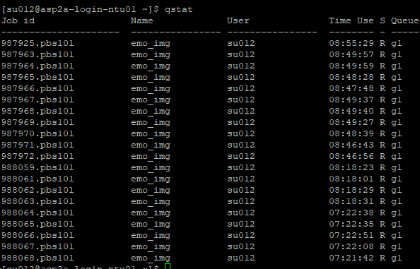

# Change Log

+ 18-OCT 2023
	+ Simplified the tutorial so that it only uses conda instead of singularity anymore.
	+ Corrected the project ID for our group.
+ 3-APR 2023
	+ Added the instruction for using Anaconda3.
+ 10-MAR 2023
	+ Revised the `job.psb` so that the examples for applying more than 1 gpus are provided.
+ 3-MAR 2023
	+ Revised the `job.psb` so that the container can know the gpu index. This prevent the bug `AssertionError: Invalid device id` when loading a checkpoint. The bug is caused by the unrecognizable gpu index assigned by the PBS-PRO to the variable `CUDA_VISIBLE_DEVICES`, which further caused `torch.cuda.is_available() = True`, yet `torch.cuda.device_count() = 0`. The revised `job.psb` manually assigns the gpu index instead. 
+ 1-MAR 2023
	+ Uploaded the correct container file (for [option 2](#option-2)).

# Table of Content<a name="table-of-content"></a>

+ [Step 1: Preparation (In Local)](#step-1-preparation-in-local)
+ [Step 2: Run (In NSCC)](#step-2-run-in-nscc)
+ [Endnote: Useful commands in NSCC](#endnote-useful-commands-in-nscc)

## Step 1: Preparation (In Local)<a name="step-1-preparation-in-local"></a>
[Return to Table of Content](#table-of-content)

First, we need to prepare the Python environment for our code. Login to your NSCC, type

```
module avail
```

so that you will see the list of all the modules. Find the Anaconda3. It should be something like `anaconda3/2022.10`. Load it by typing

```
module load anaconda3/2022.10
```

Now you can use the `conda` command. Then the rest is all the same. By **same** I mean you can `condo create` your environment and then `condo install` or `pip install` your packages. This option is available for the new nscc. By using this you don't need to bother with the messy singularity container.


## Step 2: Run (In NSCC)<a name="step-2-run-in-nscc"></a>
[Return to Table of Content](#table-of-content)

First, edit your job definition. See `jpb.psb` in detail! The examples and comments there covered everything!

Then, upload your dataset, code, and `job.psb` to NSCC. I always put `job.psb` and `main.py` in the same directory for convenience. Moreover, following NSCC's instruction, large files like dataset should be stored in `~/scratch` directory.

Finally, in the NSCC terminal, cd to the path storing `main.py`, and type
```
qsub job.pbs
```

to submit your job. If your `main.py` needs arguments, and you have already edited your `job.psb` accordingly (see `job.psb` for example), simply feed them with `-v` flag and comma separator as 
```
qsub -v bs=32,e=100 job.pbs
```

## Endnote: Useful commands in NSCC<a name="endnote-useful-commands-in-nscc"></a>
[Return to Table of Content](#table-of-content)

+ `qstat`: see the job numbers and status of your submitted jobs, but you don't know what variables you fed to the job.
+ `qstat -x -f`: see the summary of your recently submitted jobs, you can see the variables fed to the job if any.
+ `qdel <jobid>`: kill a job.
+ `qdel -W force <jobid>`: force kill a job, use this when a normal kill cannot work.


> :)