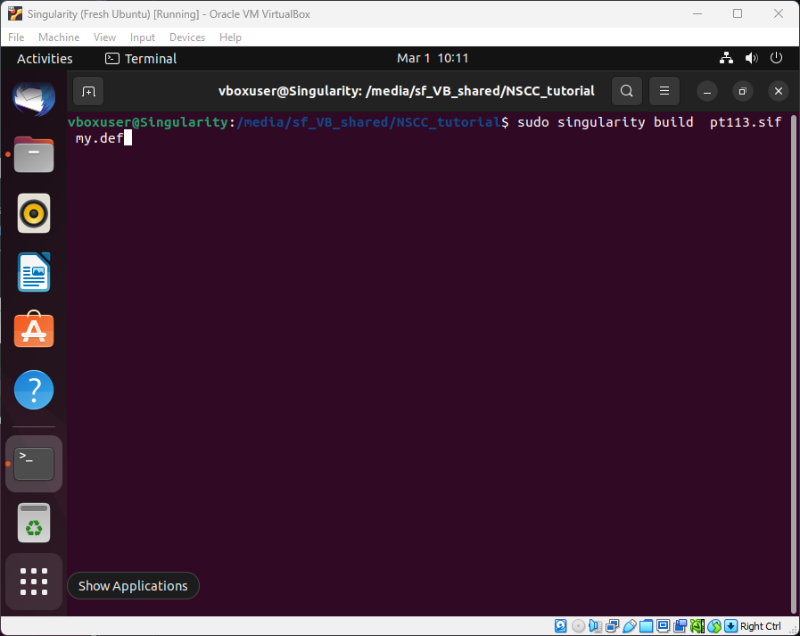
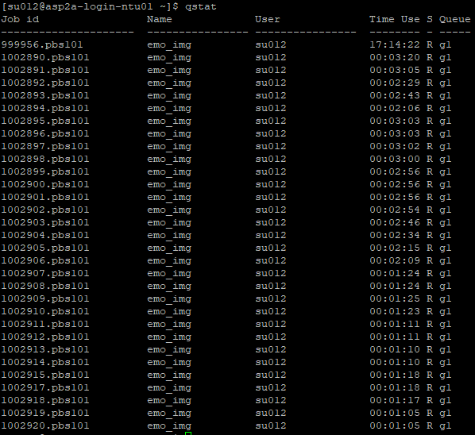

## Step 1: Preparation (Local)

First, we need to prepare the Python environment for our code. There are three options:

+ Option 1: Create your own Singularity container.
	+ Pros: Fully customizable. You can install any packages you want and built them all in the container. It's an **one-off effort**.
	+ Cons: Struggling for Singularity installation and container building. 
	+ Comment: Highly recommended and fully covered by this tutorial.
+ Option 2: Use a built container and pip install any missing packages every time you submit your jobs.
	+ Pros: Plug-and-play, no messy installation and building.
	+ Cons: Need to install missing package for each submitted job. (Mostly, missing packages are not so many. Therefore, it’s acceptable.)
	+ Comment: Use this if you want a quick try.
+ Option 3: Load the module from NSCC directly.
	+ Pros: Say goodbye to Singularity.
	+ Cons: Missing core packages. For example, the Pytorch module missed scipy, pandas, ....
	+ Comment: Never worked for me. It may work if your code is written purely using Pytorch API.

#### Option 1

TLDR: in your host, install Virtualbox with a Ubuntu 22 as the guest system, install Singularity in the guest system, build the container there, then fetch it in your host system. See below for details.

The installation of virtualbox and the Ubuntu 22 is straightforward and there is plenty of tutorials on this. Therefore I only highlight a few things:

+ Virtualbox [download](https://entuedu-my.sharepoint.com/:u:/g/personal/su012_e_ntu_edu_sg/EVzxRsD8Jx5BmBxsbxuFCNAB5_wWMezZjcy0AxwDHVtvlw?e=DYe8yC). (Why? It's light-weight, cross-platform, and open-sourced. It's a neat solution because we can simply remove the guest system to ditch the messy Singularity from your PC.)
+ Ubuntu22 [download](http://www.releases.ubuntu.com/22.04/ubuntu-22.04.2-desktop-amd64.iso) 


> Install the Ubuntu guest system on Virtualbox. Leave the username and pwd by default is totally fine (the password is `changeme`. Check the addition iso so that the host/guest sharing folder and copyboard can be available later.


> Specify the hardware for the guest system according to your host system. Usually 8G and 1/4 of your CPUs are enough.


> Specify the disk space for the guest system. Don't check `Pre-allocate Full Size`.


> Once the settings are completed, the guest system will launch. Choose `Try or install Ubuntu` to install the Ubuntu. 10-20 mins later the guest system will be ready.


> Login to the guest system using the default username and password. Note that in `Device` you should enable the sharing folder and bidirectional clipboard, so that we can copy/paste files/commands between the host and guest systems conveniently.


> Check auto-mount and make permanent for the sharing folder.


> You should see the shared folder in your ubuntu guest system after that. In your host system, put the tutorial folder there so that the guest system can access the one-click script for Singularity installation. (Note, if you cannot see the shared folder, try restarting the guest system.)


> Don't be hasty! Let's take a snapshot. A Snapshot is a checkpoint of the guest system. Later, if you screwed up your guest system, you can simply go back to the fresh stage and no need to reinstall Ubuntu again! To do so, click `Take` to take a snapshot for the fresh Ubuntu. This one is where "all things start". 


> In the tutorial directory of your guest system, right click --> Open in Terminal. First off, type `su` followed by the password `changeme` to switch to the root user. Then, type `usermod -aG sudo vboxuser` to add the user to sudoer group, and type `su vboxuser` to switch back to the user. Now, type `chmod +x install_singularity.sh` to change the one-click script to executable. Finally type `./install_singularity.sh` to install the messy Singularity! 


> The installation can take 10-20 mins. After which, type `singularity` in the terminal to confirm that the command is recognized.


> In your tutorial directory of your HOST SYSTEM, edit `my.def`. In Line 18 follow the example to add any Python packages you want. Just like how you normally install them in your conda environment. This definition file tells Singularity to build these Python packages into the container. Note that the Nvidia A100 demands cudnn8 and higher, which corresponds to a newer version of pytorch. 


> Finally, in the terminal, type `sudo singularity build  pt113.sif step_2_my.def` to build the container. After 10-20mins, a container named `pt113.sif` will be generated in the current directory (shared with the host system), and you should be able to access it from your host system. It is now ready to be uploaded to NSCC.


#### Option 2

Simply download the built container from [this link](https://entuedu-my.sharepoint.com/:f:/g/personal/su012_e_ntu_edu_sg/EmfmArJu9LtJhgGbPHyGMqgB0t33SoyM2Y_pVXgj94EBdg?e=gOZvT6), and proceed to the next step.

The downloaded file is built following the steps and settings in Option 1, with `scipy scikit-learn matplotlib pandas` installed. They may meet your common usage already.

#### Option 3

Login to your NSCC console, type `module avail` to see the available modules, and `module load pytorch` to load any modules you want.

Note that the module needs to be loaded in the runtime of your job, therefore, the `module load pytorch` commands shall be included in the job definition. You may study this option on your own but I never make it.


## Step 2 Run (In NSCC)

First, edit your job definition. See `jpb.psb` in detail! The examples and comments there covered everything!

Then, upload your container (the `.sif` file), dataset, code, and `job.psb` to NSCC. I always put `job.psb` and `main.py` in the same directory for convenience. Moreover, following NSCC's instruction, large files like dataset and container should be stored in `~/scratch` directory.

Finally, in the NSCC terminal, cd to the path storing `main.py`, and type
```
qsub job.pbs
```

to submit your job. If your `main.py` needs arguments, and you have already edit your `job.psb` accordingly (see `job.psb` for example), simply feed them with `-v` flag and comma separator as 
```
qsub -v model=supernet,lr=1e-3,modality="video audio",emotion=valence,fold=12,seed=3704 job.pbs
```

## Endnote: Useful commands in NSCC

+ `qstat`: see the job numbers and status of your submitted jobs, but you don't know what variables you fed to the job.
+ `qstat -x -f`: see the summary of your recently submitted jobs, you can see the variables fed to the job if any.
+ `qdel <jobid>`: kill a job.
+ `qdel -W force <jobid>`: force kill a job, use this when a normal kill cannot work.


> :)